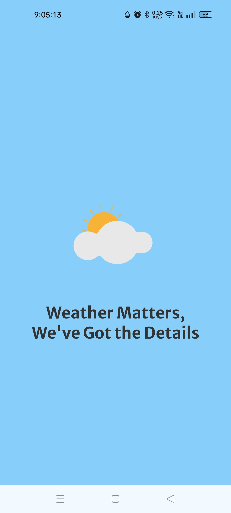
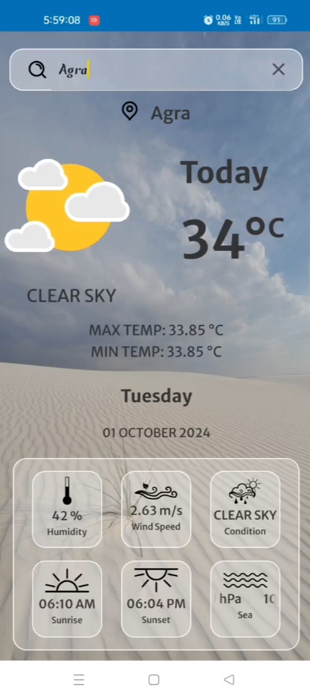
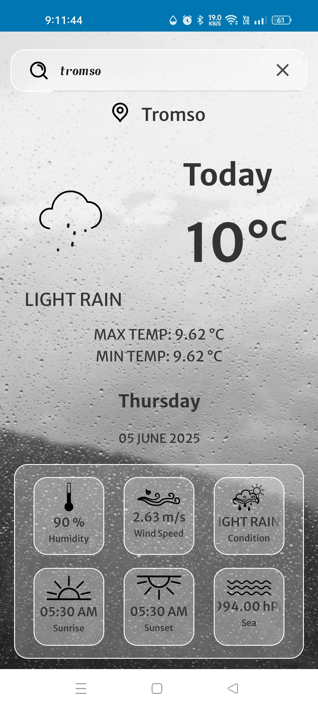
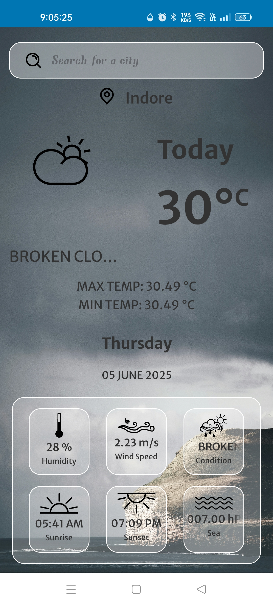

# 🌤️ SkyCast — Android Weather App

**SkyCast** is a sleek and responsive weather forecast app for Android. It delivers real-time weather updates based on city search using the OpenWeatherMap API. SkyCast also visually adapts to weather conditions with dynamic backgrounds.

---

## ✨ Features

- 🔍 Search weather by city
- 🌈 Dynamic background based on weather (Clear, Rainy, Cloudy, etc.)
- 🌡️ Display current temperature, max/min temp
- 💧 Humidity, Wind Speed, Pressure, and Conditions
- 🌅 Sunrise and Sunset timings
- 📆 Current date and day of the week

---

## 🧱 Tech Stack

- **Language:** Java
- **UI:** XML
- **API:** OpenWeatherMap
- **Networking:** Retrofit
- **IDE:** Android Studio

---

## 📸 App Screenshots

### 🚀 Splash Screen

---

### ☀️ Clear Sky Weather

---

### 🌧️ Rainy Weather

---

### 🌥️ Cloudy Weather

---

## 📥 Download APK

You can try the app by downloading the latest APK:

---

## 📬 Contact

Made with ❤️ by **Shaikh Sahil**

- 📧 Email: [sheikhsahilss2429@gmail.com](mailto:sheikhsahilss2429@gmail.com)
- 💼 LinkedIn: [linkedin.com/in/shaikhsahil01](https://www.linkedin.com/in/shaikhsahil01)
- 🐱 GitHub: [github.com/Sheikh-Sahil0](https://github.com/Sheikh-Sahil0)

---

> _“Weather matters, we’ve got the details.”_

